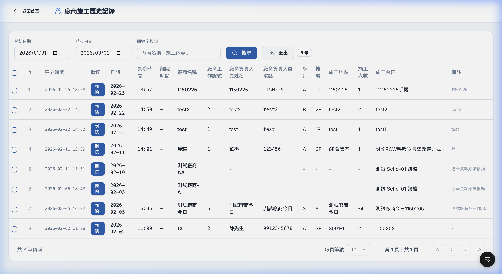
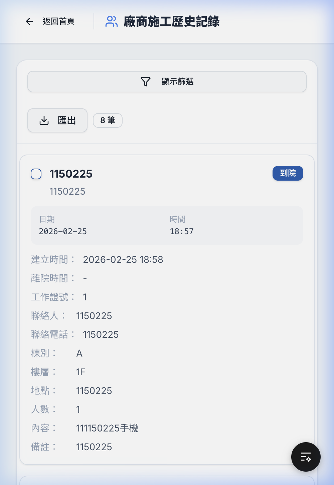
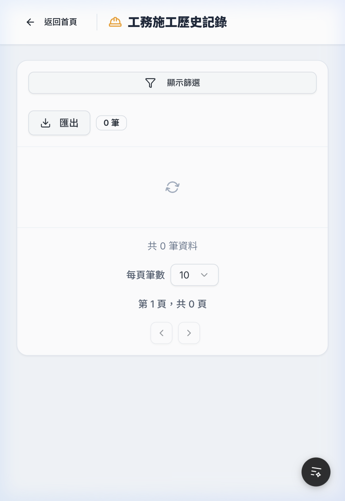
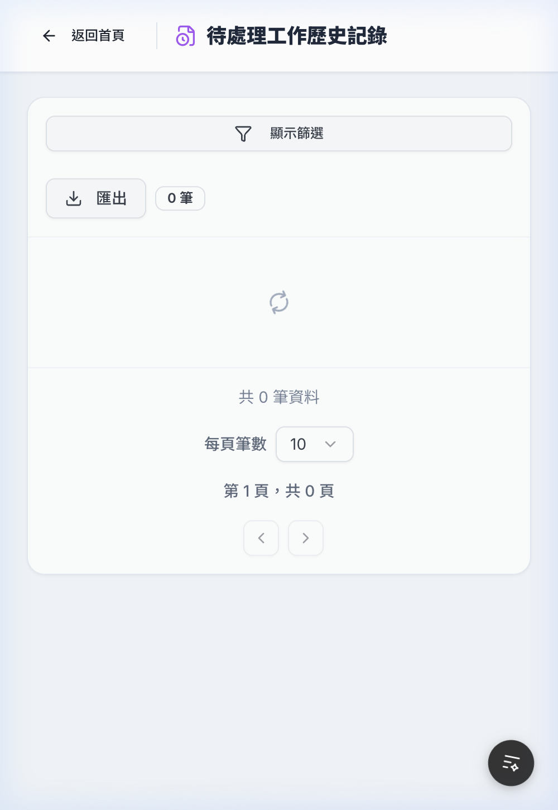
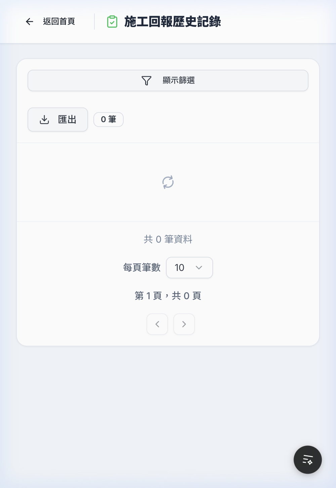

# 歷史記錄頁面手機版實作 & 移除 ID 欄位

## 變更摘要

比照「廠商今日施工」手機版卡片呈現方式，為 4 個歷史記錄頁面新增 `MobileTableCard` 手機版列表、RWD toolbar，並移除桌面版 ID 欄位。

### 修改檔案

| 檔案 | 變更 |
|------|------|
| [VendorHistoryClient.tsx](file:///Users/user/Desktop/電子白板/whiteboard-nextjs/src/app/history/vendor/VendorHistoryClient.tsx) | 移除 ID + 手機版卡片 + RWD toolbar |
| [EngineeringHistoryClient.tsx](file:///Users/user/Desktop/電子白板/whiteboard-nextjs/src/app/history/engineering/EngineeringHistoryClient.tsx) | 同上 |
| [PendingHistoryClient.tsx](file:///Users/user/Desktop/電子白板/whiteboard-nextjs/src/app/history/pending/PendingHistoryClient.tsx) | 同上 |
| [ReportHistoryClient.tsx](file:///Users/user/Desktop/電子白板/whiteboard-nextjs/src/app/history/report/ReportHistoryClient.tsx) | 同上 |

### 卡片欄位（排除 ID）

| 頁面 | title | subtitle | status Badge | 詳情欄位 |
|------|-------|----------|--------------|---------|
| 廠商歷史 | 廠商名稱 | 聯絡人 | 到院/離院 | 建立時間、離院時間、工作證號、聯絡人、電話、棟別、樓層、地點、人數、內容、備註 |
| 工務歷史 | 廠商名稱 | 負責人 | 單位 | 建立時間、施工內容、備註 |
| 待處理歷史 | 廠商名稱 | 負責人 | 單位 | 建立時間、施工內容、備註 |
| 施工回報歷史 | 廠商名稱 | 負責人 | 完成/未完成/異常 | 建立時間、地點、施工內容、備註 |

## 自動測試報告

使用管理員帳號 `rockers8210@gmail.com` 登入，瀏覽器自動測試結果：

| 測試項目 | 結果 |
|---------|------|
| 桌面版 ID 欄位移除 | ✅ 通過 |
| 廠商歷史手機版卡片（8筆資料） | ✅ 通過 |
| 工務歷史手機版 RWD layout | ✅ 通過 |
| 待處理歷史手機版 RWD layout | ✅ 通過 |
| 施工回報歷史手機版 RWD layout | ✅ 通過 |
| 顯示篩選按鈕 | ✅ 全部頁面可見 |
| 筆數 Badge | ✅ 全部頁面可見 |
| 匯出按鈕 | ✅ 全部頁面可見 |

## 驗證截圖

````carousel

<!-- slide -->

<!-- slide -->

<!-- slide -->

<!-- slide -->

````

## 瀏覽器錄影


