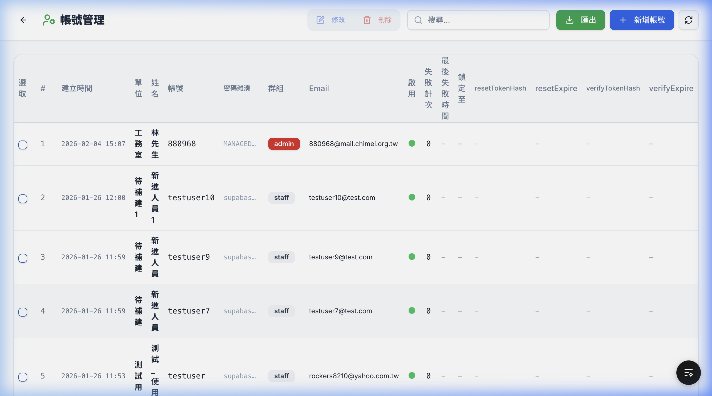
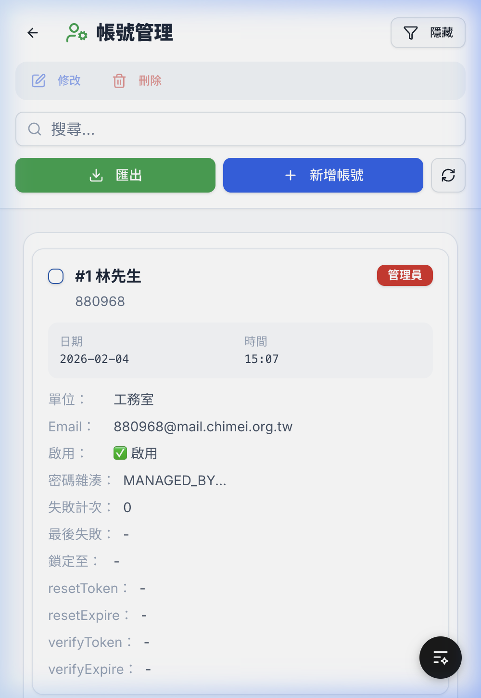
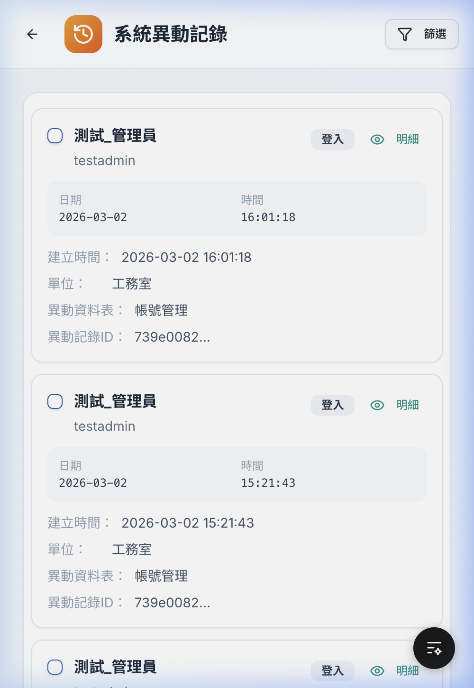
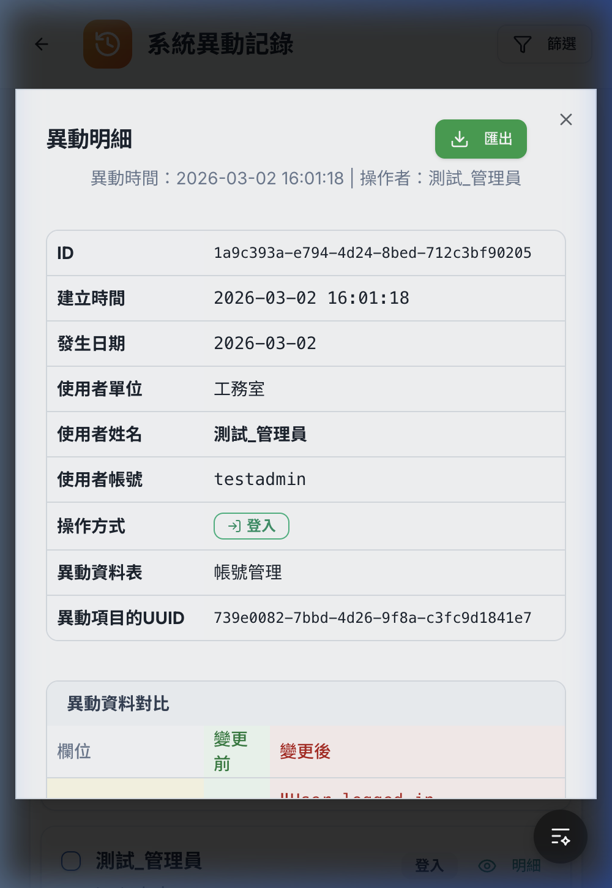
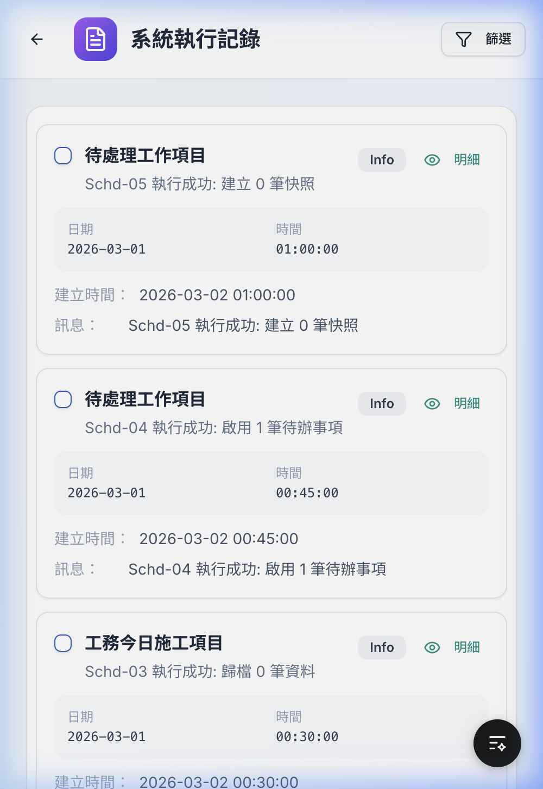
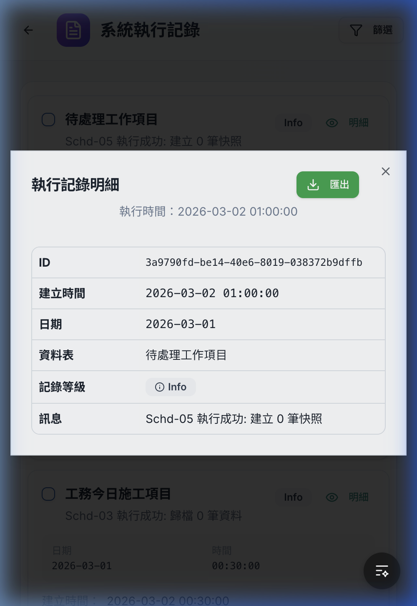

# 帳號管理與系統記錄模組 — 功能擴充與完工報告

## 擴充重點摘要
今日已全數完成「帳號管理」、「系統執行記錄」、「系統異動記錄」的跨模組功能擴充，主要包含以下實作：

1. **全面支援 RWD 與手機版卡片視圖**：導入 `MobileTableCard` 全新 UI，優化資訊呈現層級並移除冗餘的系統 UUID。
2. **每筆記錄編號 (`#`) 功能**：三模組之桌面版及手機版接已實裝流水號顯示（如 `#1`），即使切換分頁也能精準計算出絕對位置序號。
3. **手機版專屬「明細」Dialog**：由於表格空間有限，已於系統紀錄的卡片右方設定獨立按鈕可一鍵調閱完整 `Old/New Data`。
4. **增強版 Excel 匯出 (*.xlsx)**：配置支援依勾選或過濾條件一鍵匯出；並延續於明細層級之直接單筆下載功能。

## 自動測試驗證結果
所有頁面經由 Playwright (Browser Subagent) RWD 縮放雙重自動化測試，確認功能均運行無異常、視圖正常渲染。

| 模組 | RWD 切換 | 編號 (`#`) 計算 | 明細 Dialog | 匯出觸發 |
|---|:---:|:---:|:---:|:---:|
| 帳號管理 | ✅ 通過 | ✅ 通過 | (無需對話框) | ✅ 通過 |
| 系統執行記錄| ✅ 通過 | ✅ 通過 | ✅ 通過 | ✅ 通過 |
| 系統異動記錄| ✅ 通過 | ✅ 通過 | ✅ 通過 | ✅ 通過 |

## 驗證截圖

### 帳號管理
````carousel

<!-- slide -->

````

### 系統異動記錄
````carousel

<!-- slide -->

````

### 系統執行記錄
````carousel

<!-- slide -->

````
