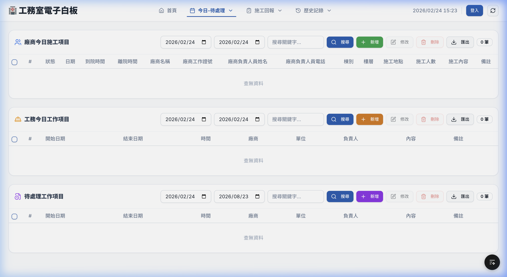

# Phase 1 測試結果報告 — 導覽列重構與色彩系統

## 實作摘要

| 項目 | 說明 |
|------|------|
| **1.1 共用 Navbar** | 抽出 `Navbar.tsx`，取代 HomeClient 和 WhiteboardClient 中的重複導覽列代碼 |
| **1.2 色彩系統** | `globals.css` 升級為品牌色系（主色醫院藍 `#1E5CB3`、新增語意色票 success/warning/info） |
| **1.3 漢堡選單** | ≤1024px 自動切換為漢堡按鈕 + 側欄 Drawer，含 slide-in 動畫 |
| **1.4 Active 指示** | 導覽項目依 `pathname` 自動高亮（底線 + 粗體 + 品牌色） |

## 代碼精簡統計

| 檔案 | 修改前 | 修改後 | 減少 |
|------|--------|--------|------|
| `HomeClient.tsx` | 743 行 | 298 行 | **-445 行** |
| `WhiteboardClient.tsx` | 794 行 | 637 行 | **-157 行** |
| 共用 `Navbar.tsx` | — | 266 行 | *新增* |
| **淨減少** | | | **-336 行** |

## 截圖驗證

### 桌面版首頁


- ✅ 共用 Navbar 正確顯示（品牌名、導覽項目、時鐘、登入按鈕）
- ✅ 「首頁」項目有 Active 底線指示
- ✅ Dropdown 選單（今日-待處理、施工回報、歷史記錄）正常運作
- ✅ 品牌色彩系統正確應用（背景淡藍灰、藍色主按鈕）

### 桌面版 Dashboard



- ✅ 同一 Navbar 元件一致呈現
- ✅ 「今日-待處理」項目有 Active 底線指示（因為在 /dashboard 路徑）
- ✅ 三個表格正常顯示

### 行動版首頁（375px）


- ✅ 漢堡按鈕顯示於左側
- ✅ 導覽項目隱藏，改用漢堡選單
- ✅ 統計卡片自動改為單欄堆疊
- ✅ 品牌名稱和登入按鈕正確配置

## 自動化測試結果

```
✓ Vitest 2/2 passed (792ms)
  ✓ 能正確 render React 元件
  ✓ 基本斷言正常運作
```

## 修改的檔案清單

| 檔案 | 動作 |
|------|------|
| [Navbar.tsx](file:///Users/user/Desktop/電子白板/whiteboard-nextjs/src/components/Navbar.tsx) | **新增** — 共用導覽列 |
| [globals.css](file:///Users/user/Desktop/電子白板/whiteboard-nextjs/src/app/globals.css) | **修改** — 品牌色彩系統 |
| [HomeClient.tsx](file:///Users/user/Desktop/電子白板/whiteboard-nextjs/src/app/HomeClient.tsx) | **修改** — 移除內嵌導覽列 |
| [WhiteboardClient.tsx](file:///Users/user/Desktop/電子白板/whiteboard-nextjs/src/app/WhiteboardClient.tsx) | **修改** — 移除內嵌導覽列 |
