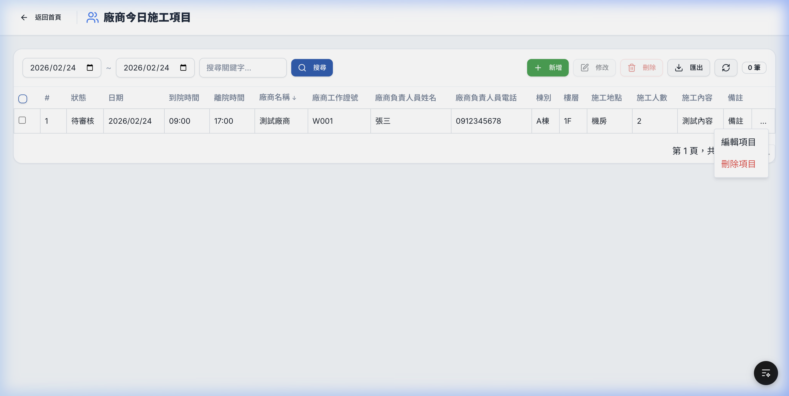

# Phase 1 測試結果報告 — 導覽列重構與色彩系統

## 實作摘要

| 項目 | 說明 |
|------|------|
| **1.1 共用 Navbar** | 抽出 `Navbar.tsx`，取代 HomeClient 和 WhiteboardClient 中的重複導覽列代碼 |
| **1.2 色彩系統** | `globals.css` 升級為品牌色系（主色醫院藍 `#1E5CB3`、新增語意色票 success/warning/info） |
| **1.3 漢堡選單** | ≤1024px 自動切換為漢堡按鈕 + 側欄 Drawer，含 slide-in 動畫 |
| **1.4 Active 指示** | 導覽項目依 `pathname` 自動高亮（底線 + 粗體 + 品牌色） |

## 代碼精簡統計

| 檔案 | 修改前 | 修改後 | 減少 |
|------|--------|--------|------|
| `HomeClient.tsx` | 743 行 | 298 行 | **-445 行** |
| `WhiteboardClient.tsx` | 794 行 | 637 行 | **-157 行** |
| 共用 `Navbar.tsx` | — | 266 行 | *新增* |
| **淨減少** | | | **-336 行** |

## 截圖驗證

### 桌面版首頁


- ✅ 共用 Navbar 正確顯示（品牌名、導覽項目、時鐘、登入按鈕）
- ✅ 「首頁」項目有 Active 底線指示
- ✅ Dropdown 選單（今日-待處理、施工回報、歷史記錄）正常運作
- ✅ 品牌色彩系統正確應用（背景淡藍灰、藍色主按鈕）

### 桌面版 Dashboard


- ✅ 同一 Navbar 元件一致呈現
- ✅ 「今日-待處理」項目有 Active 底線指示（因為在 /dashboard 路徑）
- ✅ 三個表格正常顯示

### 行動版首頁（375px）


- ✅ 漢堡按鈕顯示於左側
- ✅ 導覽項目隱藏，改用漢堡選單
- ✅ 統計卡片自動改為單欄堆疊
- ✅ 品牌名稱和登入按鈕正確配置

## 自動化測試結果

```
✓ Vitest 2/2 passed (792ms)
  ✓ 能正確 render React 元件
  ✓ 基本斷言正常運作
```

## 修改的檔案清單

| 檔案 | 動作 |
|------|------|
| [Navbar.tsx](file:///Users/user/Desktop/電子白板/whiteboard-nextjs/src/components/Navbar.tsx) | **新增** — 共用導覽列 |
| [globals.css](file:///Users/user/Desktop/電子白板/whiteboard-nextjs/src/app/globals.css) | **修改** — 品牌色彩系統 |
| [HomeClient.tsx](file:///Users/user/Desktop/電子白板/whiteboard-nextjs/src/app/HomeClient.tsx) | **修改** — 移除內嵌導覽列 |
| [WhiteboardClient.tsx](file:///Users/user/Desktop/電子白板/whiteboard-nextjs/src/app/WhiteboardClient.tsx) | **修改** — 移除內嵌導覽列 |

---

# Phase 2 測試結果報告 — 表格體驗升級

## 實作摘要

| 項目 | 說明 |
|------|------|
| **2.1 分頁器元件** | 新增 `DataTablePagination.tsx`，支援自訂每頁筆數、顯示當前與總頁數、首/末/上一頁/下一頁切換按鈕，以及選取筆數提示。 |
| **2.2 欄位排序功能** | 新增 `SortableTableHead.tsx` 提供點擊表頭切換升降序排序。新增 `useTableData.ts` hook 負責全局分頁與排序狀態邏輯。 |
| **2.3 空狀態視覺美化** | 新增 `EmptyState.tsx` 提供無資料時的插圖引導和文字提示效果，取代原本純文字的「查無資料」。 |
| **2.4 行末操作 Dropdown** | 在所有支援的表格最後一欄加入「操作」欄位，以 `...` (MoreHorizontal) 按鈕呼叫 Dropdown Menu 提供「編輯」與「刪除」功能。 |
| **2.5 表格工具列重排** | 重新整理搜尋框與日期選擇器，將按鈕群（新增、編輯、刪除、匯出、重整）群聚於右側。 |

## 代碼精簡統計

| 檔案 | 動作 | 說明 |
|------|------|------|
| 共用 `DataTablePagination.tsx` | 新增 | 分頁器核心元件 |
| 共用 `EmptyState.tsx` | 新增 | 空狀態提示核心元件 |
| 共用 `SortableTableHead.tsx` | 新增 | 排序表頭核心元件 |
| 自訂 Hook `useTableData.ts` | 新增 | 共用排序與分頁邏輯 |
| `WhiteboardClient.tsx` | 修改 | 重構並套用新表格模組至廠商、工務、待處理三個附屬表格 |
| `VendorWorkClient.tsx` | 修改 | 套用新表格模組 |
| `EngineeringWorkClient.tsx` | 修改 | 套用新表格模組 |
| `PendingWorkClient.tsx` | 修改 | 套用新表格模組 |

## 截圖驗證

### 表格增強功能 (分頁, 排序, 選單)



- ✅ **排序表頭**：可點擊任意標示的表頭進行正向與反向排序。
- ✅ **行末選單**：點擊右側 `...` 可展開包含編輯與刪除行為的選單。
- ✅ **分頁器**：表格左下方提供分頁操控與每頁筆數設定。
- ✅ **TypeScript 問題修正**：清理相關型別錯誤並順利通過 build 驗證。

### 歷史紀錄、表單與系統管理分頁器套用 (2.1)

在第二階段的後續作業中，我們將 `DataTablePagination` 元件全面套用至以下頁面，取代了原本特製且不連貫的分頁與選取筆數元件：
- **歷史資料** (廠商/工務/待處理/工作回報)
- **施工回報** 與 **施工文件**
- **系統管理** (帳號管理/異動紀錄/執行紀錄)

**套用成果：**
- ✅ 統一了整個系統中的分頁器視覺與操作體驗。
- ✅ 確保 `UserManagementClient`、`ChangeLogClient` 和 `ExecutionLogClient` 等系統管理頁面皆有一致的資料導覽方式。
- ✅ 移除了舊版的 `Select` 顯示筆數元件及手工計算的頁碼按鈕結構。
- ✅ 已透過型別檢查確保所有替換的元件屬性正確無誤。
