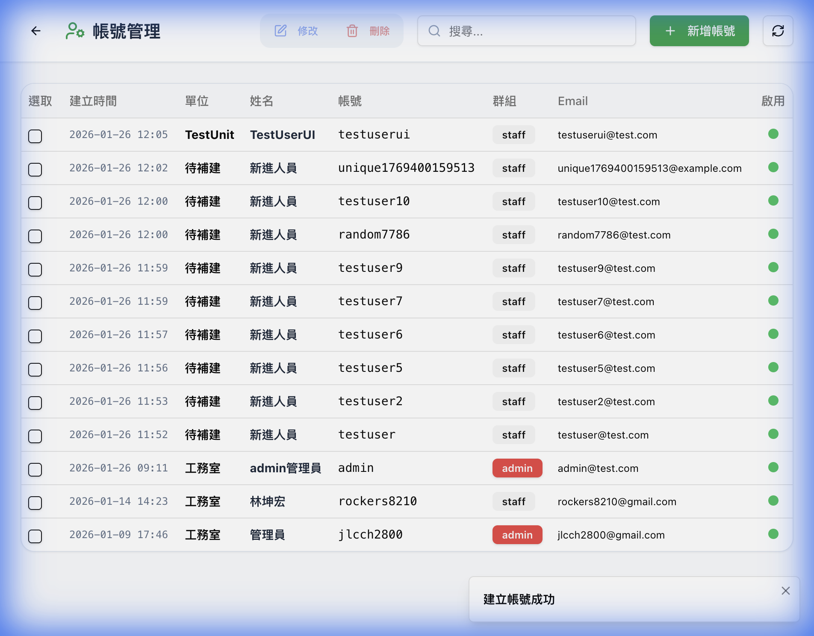

# 帳號管理密碼功能 - 完成報告

## 實作內容

### 1. API Route (`/api/admin/users/route.ts`)
- **POST**：建立新帳號（使用 Supabase Admin API `createUser()`）
- **PUT**：更新帳號資料和密碼（使用 `updateUserById()`）
- **DELETE**：刪除帳號
- 使用 Service Role Key 安全處理密碼

### 2. 前端表單修改 (`UserManagementClient.tsx`)
新增並修改：
- 密碼欄位（新增時必填，修改時選填）
- 確認密碼欄位
- 表單提交改為呼叫 API Route

### 3. Schema 驗證更新 (`schemas.ts`)
- 密碼強度驗證（8字元以上，含大小寫+數字+符號至少3種）
- 密碼一致性驗證

---

## 遇到的問題與解決

| 問題 | 原因 | 解決方案 |
|------|------|----------|
| `password_hash` NOT NULL 錯誤 | DB schema 要求此欄位 | 使用 placeholder `'MANAGED_BY_SUPABASE_AUTH'` |
| Primary key 重複錯誤 | Supabase 觸發器自動建立 `public.users` 記錄 | 改用 `upsert` 取代 `insert` |

---

## 測試結果

- ✅ API 新增帳號成功：`{success: true, userId: "..."}`
- ✅ UI 表單新增成功：顯示「建立帳號成功」提示
- ✅ 帳號列表正確顯示新建立的使用者

---

## 檔案變更

| 檔案 | 變更類型 |
|------|----------|
| [route.ts](file:///Users/user/Desktop/電子白板/whiteboard-nextjs/src/app/api/admin/users/route.ts) | 新增 |
| [UserManagementClient.tsx](file:///Users/user/Desktop/電子白板/whiteboard-nextjs/src/app/admin/users/UserManagementClient.tsx) | 修改 |
| [schemas.ts](file:///Users/user/Desktop/電子白板/whiteboard-nextjs/src/lib/validations/schemas.ts) | 修改 |
