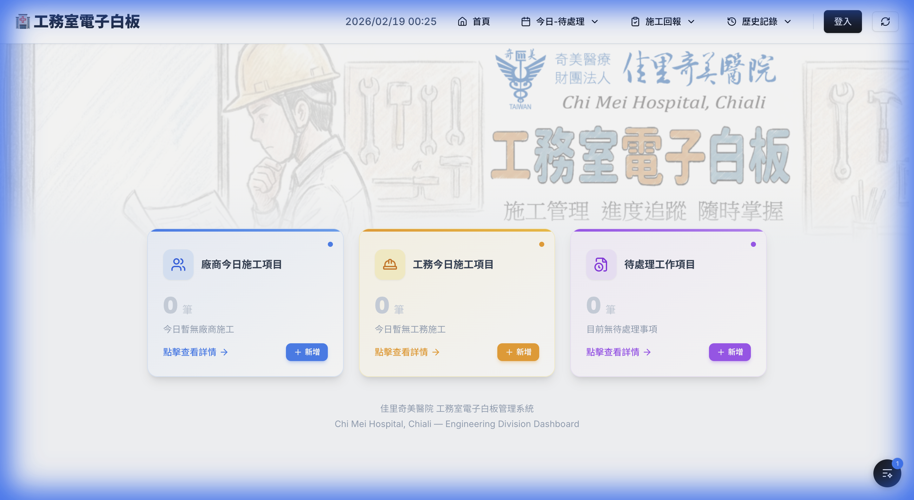

# 首頁背景圖與新增按鈕優化

## 完成項目

### 1. 背景圖片調整
- 更換背景圖片為新版 Cloudinary 圖片
- 高度調整為 `40vh`（使用者最終手動設定）
- 圖片對齊設為 `object-top`，僅裁切底部保留上方完整畫面
- 修復誤插入 JSX 中的常數宣告文字

### 2. 統計卡片新增按鈕
為三張統計卡片各增加了「+ 新增」按鈕：

| 卡片 | 按鈕顏色 | 導向路由 |
|------|---------|---------|
| 廠商今日施工項目 | 藍色 | `/vendor-work/new` |
| 工務今日施工項目 | 琥珀色 | `/engineering-work/new` |
| 待處理工作項目 | 紫色 | `/pending-work/new` |

**技術細節：**
- 按鈕使用 `e.stopPropagation()` 防止觸發卡片整體的 `onClick` 導航
- 每個按鈕的顏色與卡片主題色一致（`addBtnBg`、`addBtnHover`）
- 包含 hover 上移、陰影加深、active 縮放等微互動

## 修改檔案
- [HomeClient.tsx](file:///Users/user/Desktop/電子白板/whiteboard-nextjs/src/app/HomeClient.tsx)

## 驗證結果
- ✅ 開發伺服器正常運行
- ✅ 三張卡片的「新增」按鈕正確顯示且樣式一致
- ✅ 背景圖片正確載入且裁切方式符合預期

